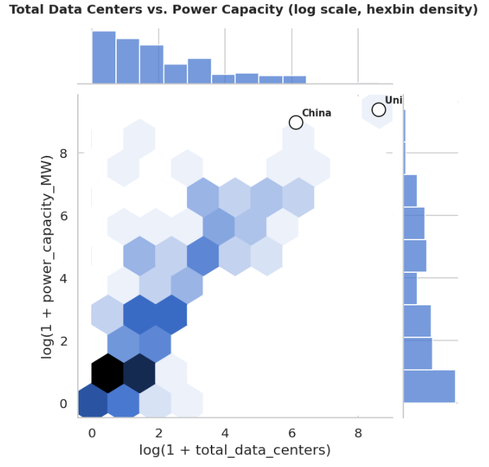
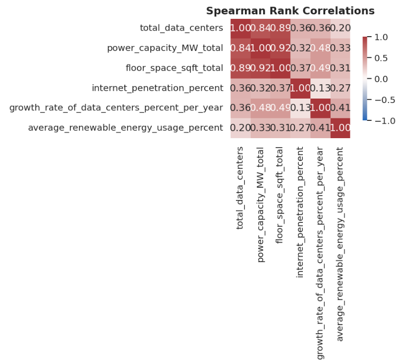
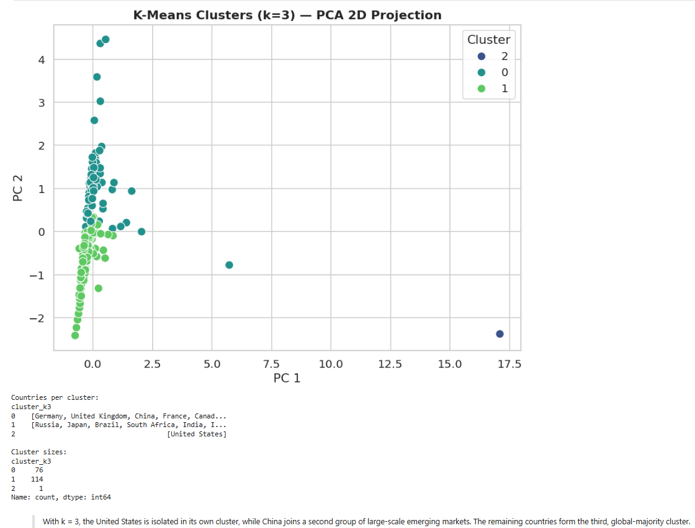

# Global Data Center Sustainability Analysis

Machine learning and data analysis project exploring global data center sustainability, renewable energy adoption, infrastructure growth, and Green AI trends across countries worldwide.

---

## Project Overview

This project investigates the relationship between:

- Data center growth
- Power consumption
- Renewable energy adoption
- Internet penetration
- Infrastructure scaling trends

Using machine learning, statistical analysis, and feature engineering, the project explores how countries differ in sustainability adoption and infrastructure efficiency within the rapidly growing global data center ecosystem.

This analysis served as the technical backbone for the accompanying research paper:

📄 **Toward Sustainable Artificial Intelligence**

---

## Objectives

- Analyze global data center infrastructure trends
- Investigate renewable energy adoption patterns
- Build predictive machine learning models
- Explore relationships between infrastructure scale and sustainability
- Evaluate how internet growth and hyperscale infrastructure impact energy usage
- Demonstrate practical applications of machine learning for sustainability analysis

---

## Technologies Used

- Python
- Pandas
- NumPy
- Scikit-learn
- XGBoost
- Matplotlib
- Seaborn
- Jupyter Notebook

---

## Machine Learning Workflow

The project includes:

- Data cleaning and preprocessing
- Feature engineering
- Exploratory Data Analysis (EDA)
- Statistical analysis
- Correlation analysis
- Predictive modeling
- Model evaluation and validation
- Scenario analysis and forecasting

Models and techniques explored include:

- Linear Regression
- Ridge Regression
- XGBoost Regressor
- Feature scaling
- Cross-validation
- Log transformations
- Engineered sustainability metrics

---

## Key Insights

Some of the key findings explored in this project include:

- Significant disparities in renewable energy adoption across countries
- Strong relationships between infrastructure scale and power demand
- Challenges in predicting sustainability adoption using traditional infrastructure metrics alone
- The importance of feature engineering and data quality in real-world ML workflows
- Evidence supporting the importance of sustainable infrastructure planning as AI and cloud demand continue to scale globally

---

## Sample Visualizations

### Infrastructure Scaling Relationships

### Correlation Analysis

### Clustering & PCA Analysis

---

## Repository Contents

| File | Description |
|------|-------------|
| `Toward_Sustainable_Artificial_Intelligence.ipynb` | Main analysis notebook |
| `Global_Data_Center.xlsx` | Dataset used for analysis |
| `README.md` | Project documentation |

---

## Related Research

This repository accompanies the research paper:

📄 **Toward Sustainable Artificial Intelligence**

The paper explores sustainability challenges in modern AI infrastructure and discusses the role of efficient machine learning systems, renewable energy adoption, and scalable infrastructure planning.

---

## Author

**Nino Miljkovic**  
Data Scientist | Machine Learning | Explainable AI | Analytics

🔗 Portfolio: https://nino-11.github.io/  
🔗 LinkedIn: https://www.linkedin.com/in/nino-miljkovic-10800627/  
🔗 GitHub: https://github.com/Nino-11
